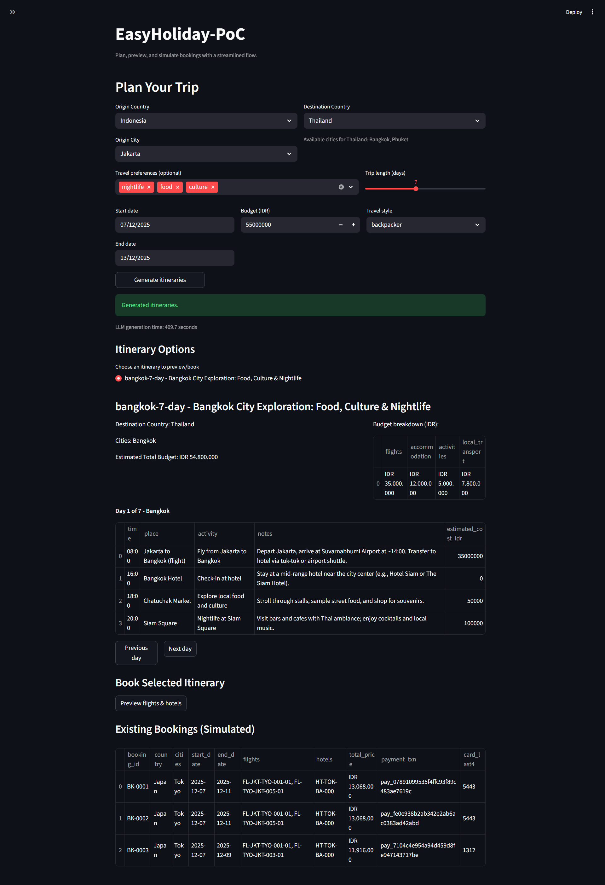

# EasyHoliday-PoC

Proof-of-concept Streamlit app that plans trips with an LLM, maps itineraries to sample inventory, and can simulate bookings.

## Requirements
- Python 3.10+ recommended
- Install dependencies: `pip install -r requirements.txt`
- Ollama running locally with the configured model (default: `qwen3:4b-instruct`; see `src/llm_client.py`)

## How to Use
1) **Install & run**  
   ```bash
   pip install -r requirements.txt
   streamlit run src/app.py
   ```
2) **Payment (optional)**  
   Open the sidebar expander, add a mock card, and choose whether to allow auto-booking.
3) **Plan a trip**  
   Select origin/destination, preferences, travel style, dates, and budget. Click “Generate itineraries” to get LLM-generated options.
4) **Preview itineraries**  
   Pick an option via the radio selector; step through days with the nav buttons. Budget breakdown stays visible for quick comparison.
5) **Book or simulate**  
   If auto-booking is allowed, confirm booking; otherwise review proposed flights/hotels and stay plan.

### UI Preview (replace placeholders later)



## Structure
- `src/`: core app entry point, agents, tools, and sample data
- `docs/`: solution notes and planning docs
- `requirements.txt`: base dependencies

## Next Steps
- Harden parsing/validation, improve tests, and refine UI polish.
